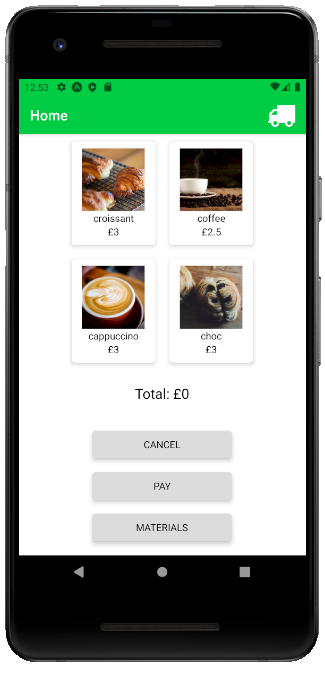

# Green Foodtruck

An app to follow sales and stock levels of a local foodtruck.

### Home screen


### Tech used:
* React Native
* RN Firebase
* Cypress
* Jest & React native testing library

### How to use:

* Clone this repo and navigate to the local folder
* Install all dependencies by typing in the terminal:
```
npm install
```
* To run the app, type in the terminal:
```
expo start
```
* Install the Expo client app on your iOS or Android phone, connect to the same wireless network as your computer
* On Android, use the Expo app to scan the QR code from the terminal to open the project.
* On iOS, follow on-screen instructions to get a link.

### How to run tests:

* Start the app in the browser
```
expo start -w
```
This starts the app on localhost.
* In the `cypress.json` file, replace the `baseUrl` with your own `<localhost>:<port>`, where url is the port where the app is running.

* Run the tests in the terminal while the app is running:
```
npx cypress open
```
